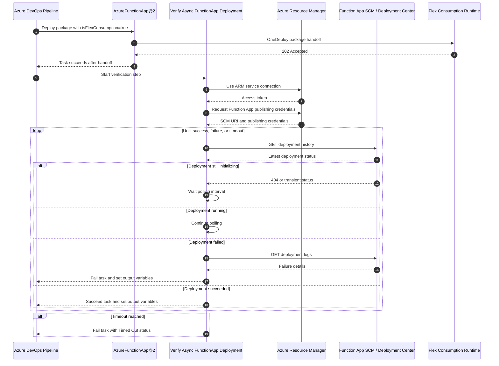

# Verify Async FunctionApp Deployment

## 2 Minute Read

`Verify Async FunctionApp Deployment` is a custom Azure DevOps task for Azure Functions running on the Flex Consumption plan.

It is designed to run immediately after `AzureFunctionApp@2` when `isFlexConsumption: true` is enabled. The official deployment task can hand the package to Azure successfully and finish after Azure returns `202 Accepted`, while the actual OneDeploy work continues asynchronously inside Azure. That background work can still fail during package processing, compilation, storage access, or trigger synchronization.

This extension closes that gap by adding a blocking verification step. It uses the selected Azure Resource Manager service connection, resolves the target Function App SCM endpoint, polls Deployment Center/Kudu deployment status, and fails the pipeline if Azure reports a failed background deployment or if verification times out.

Default behavior:

- Polls every `30` seconds.
- Times out after `5` minutes.
- Treats early `404 Not Found` deployment records as transient.
- Retries transient Azure setup and polling API failures.
- Treats an exhausted transient polling request as a failed poll attempt, then waits for the next poll.
- Fails the task with the best Azure/Kudu deployment error message when Azure reports failure.
- Exposes deployment status, error message, duration, and deployment id as output variables.

This task does not replace `AzureFunctionApp@2`. It verifies what happens after `AzureFunctionApp@2` has handed the deployment package to Azure.

## What This Extension Does

Azure Functions Flex Consumption uses OneDeploy. In Azure Pipelines, the package handoff can complete before Azure finishes the real background deployment lifecycle. That creates a state mismatch: the pipeline step can be green while the Function App deployment is broken.

This extension adds a second task named `Verify Async FunctionApp Deployment` that:

- Authenticates with the Azure Resource Manager service connection selected in the pipeline.
- Supports service-principal-secret and Workload Identity Federation service connections.
- Resolves the Function App resource group automatically from the selected app name.
- Reads the Function App publishing profile through Azure Resource Manager.
- Derives the SCM endpoint dynamically from Azure instead of assuming a hardcoded host.
- Polls the Deployment Center/Kudu deployment API for the latest fresh deployment record.
- Ignores stale deployment records from before the current verification window.
- Retries transient token, Azure Resource Manager, publishing credential, and Kudu API failures with bounded internal backoff.
- Handles temporary `404`, `408`, `409`, `429`, and `5xx` polling responses as transient polling states.
- Parses deployment logs for actionable failure messages and uses that message as the task error.
- Can print additional failure context when verbose failure logs are enabled.
- Sets Azure DevOps output variables for downstream tasks.
- Returns a definitive `Succeeded` or `Failed` task result.

## Sequence Diagram



## Repository Layout

```text
.
|-- extension-manifest.json
|-- images
|   |-- icon.png
|   `-- icon.svg
|-- LICENSE
|-- README.md
|-- scripts
|   |-- generate-icon.ps1
|   `-- prepare-extension-manifest.ps1
`-- VerifyAsyncFunctionAppDeployment
    |-- index.js
    |-- package.json
    `-- task.json
```

Key files:

- `extension-manifest.json`: Marketplace extension manifest and task contribution wiring.
- `images/icon.png`: Marketplace extension icon referenced by the manifest.
- `images/icon.svg`: Editable source for the extension icon.
- `scripts/generate-icon.ps1`: Reproducible renderer for the 128x128 PNG icon.
- `scripts/prepare-extension-manifest.ps1`: Build-time publisher token replacement script.
- `VerifyAsyncFunctionAppDeployment/task.json`: Azure DevOps task metadata, inputs, outputs, and Node20/Node16 handlers.
- `VerifyAsyncFunctionAppDeployment/index.js`: Runtime implementation.
- `VerifyAsyncFunctionAppDeployment/package.json`: Task dependency manifest.
- `LICENSE`: MIT license.

## Inputs

| Input | Required | Default | Description |
| --- | --- | --- | --- |
| `connectedServiceNameARM` / `azureSubscription` | Yes | None | Azure Resource Manager service connection. |
| `functionAppName` / `appName` | Yes | None | Function App name to verify. In the classic editor, this can be selected from Function Apps in the Azure subscription. |
| `pollingIntervalSeconds` | Yes | `30` | Seconds between deployment status checks. |
| `timeoutMinutes` | Yes | `5` | Maximum verification time before failing as timed out. |
| `verboseFailureLogs` | No | `false` | Prints additional Azure deployment and log context when deployment verification fails. |

## Output Variables

| Output | Description |
| --- | --- |
| `deploymentStatus` | Final status: `Succeeded`, `Failed`, or `Timed Out`. |
| `errorMessage` | Failure or timeout detail, if available. |
| `deploymentDuration` | Verification duration in seconds. |
| `deploymentId` | Deployment Center/Kudu deployment id. |

For YAML pipelines, give the task step a `name` if downstream steps need output variables:

```yaml
- task: VerifyAsyncFunctionAppDeployment@1
  name: verifyFlexDeployment
  inputs:
    azureSubscription: $(azureSubscription)
    functionAppName: $(functionAppName)

- script: |
    echo "Deployment status: $(verifyFlexDeployment.deploymentStatus)"
    echo "Deployment id: $(verifyFlexDeployment.deploymentId)"
```

## Example Pipeline Usage

```yaml
steps:
- task: AzureFunctionApp@2
  displayName: Deploy Function App
  inputs:
    azureSubscription: $(azureSubscription)
    appType: functionAppLinux
    isFlexConsumption: true
    appName: $(functionAppName)
    package: $(Pipeline.Workspace)/drop/function.zip

- task: VerifyAsyncFunctionAppDeployment@1
  name: verifyFlexDeployment
  displayName: Verify Async FunctionApp Deployment
  inputs:
    azureSubscription: $(azureSubscription)
    functionAppName: $(functionAppName)
    pollingIntervalSeconds: 30
    timeoutMinutes: 5
    verboseFailureLogs: false
```

## Build Instructions

### Prerequisites

Install these tools on the build machine:

- Node.js 16 or later.
- npm.
- Azure DevOps extension CLI:

```powershell
npm install -g tfx-cli
```

### 1. Generate the Marketplace Manifest

The committed `extension-manifest.json` intentionally keeps this placeholder:

```json
"publisher": "__PUBLISHER_ID__"
```

Do not edit the committed manifest just to build or publish. Generate a local manifest with your Visual Studio Marketplace publisher id:

```powershell
.\scripts\prepare-extension-manifest.ps1 -PublisherId "your-publisher-id"
```

Or set the publisher id through an environment variable:

```powershell
$env:PUBLISHER_ID = "your-publisher-id"
.\scripts\prepare-extension-manifest.ps1
```

This creates `extension-manifest.generated.json`, which is ignored by git.

### 2. Install Task Dependencies

The task ships its Node dependencies inside the task folder. Install from that folder:

```powershell
Set-Location .\VerifyAsyncFunctionAppDeployment
npm install --omit=dev
Set-Location ..
```

This creates `VerifyAsyncFunctionAppDeployment/node_modules`, which must be included in the VSIX package.

### 3. Validate the JSON and JavaScript

```powershell
Get-Content -Raw .\extension-manifest.json | ConvertFrom-Json | Out-Null
Get-Content -Raw .\extension-manifest.generated.json | ConvertFrom-Json | Out-Null
Get-Content -Raw .\VerifyAsyncFunctionAppDeployment\task.json | ConvertFrom-Json | Out-Null
node --check .\VerifyAsyncFunctionAppDeployment\index.js
```

### 4. Package the Extension

Run from the repository root. The default script packages with publisher `BreakDownFramework`:

```powershell
npm run package
```

That script runs manifest generation, validation, and `tfx extension create`.

To package with a different publisher id without editing the committed manifest:

```powershell
$env:PUBLISHER_ID = "your-publisher-id"
npm run package:publisher
```

The underlying `tfx` command uses the generated manifest:

```powershell
tfx extension create --manifest-globs .\extension-manifest.generated.json
```

The command produces a `.vsix` file named with the publisher, extension id, and version. The `.vsix` output is ignored by git.

## Publishing Instructions

### 1. Sign in to Azure DevOps Marketplace

```powershell
tfx login
```

Use a Personal Access Token with Marketplace publishing permissions for your publisher.

### 2. Publish the Extension

```powershell
.\scripts\prepare-extension-manifest.ps1 -PublisherId "your-publisher-id"
tfx extension publish --manifest-globs .\extension-manifest.generated.json
```

If you already created the VSIX and want to publish that exact package:

```powershell
tfx extension publish --vsix .\your-publisher-id.verify-async-functionapp-deployment-1.2.0.vsix
```

Replace the VSIX filename with the actual file produced by `tfx extension create`.

### 3. Share or Install the Extension

For private distribution, share the extension with the target Azure DevOps organization:

```powershell
tfx extension share `
  --publisher your-publisher-id `
  --extension-id verify-async-functionapp-deployment `
  --share-with your-org-name
```

Then install it into the organization:

```powershell
tfx extension install `
  --publisher your-publisher-id `
  --extension-id verify-async-functionapp-deployment `
  --service-url https://dev.azure.com/your-org-name
```

### 4. Version Updates

Azure DevOps task updates require version changes in two places:

- `extension-manifest.json` for the extension package version.
- root `package.json` for local packaging script metadata.
- `VerifyAsyncFunctionAppDeployment/package.json` and `package-lock.json` for task package metadata.
- `VerifyAsyncFunctionAppDeployment/task.json` for the task version.

For bug fixes, increment the patch version. For input/output changes or behavior changes, increment the minor or major version as appropriate.

## Operational Notes

- Use this task only after a Flex Consumption deployment handoff.
- The Azure service connection needs permissions to list Function Apps, read the selected Function App, and list publishing credentials.
- Workload Identity Federation may require classic pipelines to allow task access to the system OAuth token.
- Timeout should be long enough for package download, build, and trigger sync in the target environment.
- If a polling API call still has a transient failure after internal retries, the task logs the unavailable status and continues at the next polling interval.
- The task fails closed: unknown terminal states, malformed deployment records, and timeout are treated as pipeline failures.

## Troubleshooting

### The task cannot resolve SCM credentials

Confirm the service connection identity has permission to call:

```text
Microsoft.Web/sites/config/list/action
```

### The task cannot find the Function App

Confirm the selected service connection can list Function Apps in the subscription:

```text
Microsoft.Web/sites/read
```

### The task receives a management.core.windows.net audience error

Use version `1.2.0` or later. Earlier versions could use the service connection's legacy Azure Service Management URL as the ARM REST endpoint, which produced token audience mismatches such as:

```text
The JWT token does not contain expected audience uri 'https://management.core.windows.net/'.
```

### The task times out

Increase `timeoutMinutes` if the Function App is in a locked-down network, uses private endpoints, or routinely takes longer to sync triggers.

### The task fails with OIDC or Workload Identity Federation errors

For classic pipelines, ensure the pipeline can expose the system OAuth token to tasks. Alternatively, use an Azure Resource Manager service connection backed by a service principal secret.

### The task succeeds but downstream variable references are empty

Give the task step a `name` and reference variables through that step name:

```yaml
$(verifyFlexDeployment.deploymentStatus)
```

## License

This project is licensed under the MIT License. See `LICENSE`.
